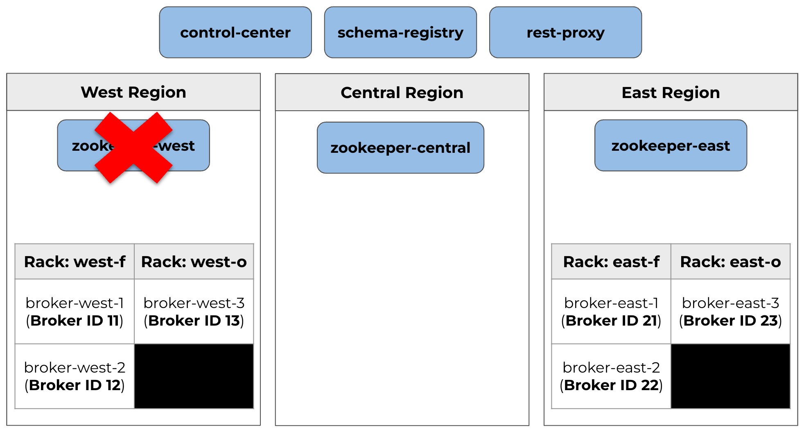

# Confluent Platform Multi Region Cluster Demo

## Pre-requisites
- docker
- docker-compose
- browser

## Start the demo
- Start the services: `docker-compose up -d`
- 2.5 Multi-Region-Cluster:

- Wait around 60 seconds or so and check that services are running: `docker-compose ps`
- Check everything is healthy by pointing a browser at http://localhost:9021
- Create topics: `./scripts/create-topics.sh`
```
==> Creating topic t1
Created topic t1.

==> Creating topic t1-obs
Created topic t1-obs.
```
- Examine the topic descriptions, note leaders, replicas, observers, and min-insync-replica configurations: `./scripts/describe-topics.sh`
```
==> Describing topic: t1
Topic: t1       TopicId: 2t8WVau3RXSGa8kcMWdsdQ PartitionCount: 1       ReplicationFactor: 4
Configs: min.insync.replicas=3
confluent.placement.constraints={"version":1,"replicas":[{"count":2,"constraints":{"rack":"west-f"}},{"count":2,"constraints":{"rack":"east-f"}}],"observers":[]}
        Topic: t1
        Partition: 0
        Leader: 11
        Replicas: 11,12,21,22
        Isr: 11,12,21,22 --> OK (min.insync.replicas=3)
        Offline: 

==> Describing topic: t1-obs
Topic: t1-obs   TopicId: svyo9HgsSwieLrT5kLeLpQ PartitionCount: 1       ReplicationFactor: 6
Configs: min.insync.replicas=3
confluent.placement.constraints={"observerPromotionPolicy":"under-min-isr","version":2,"replicas":[{"count":2,"constraints":{"rack":"west-f"}},{"count":2,"constraints":{"rack":"east-f"}}],"observers":[{"count":1,"constraints":{"rack":"west-o"}},{"count":1,"constraints":{"rack":"east-o"}}]}
        Topic: t1-obs
        Partition: 0
        Leader: 11
        Replicas: 11,12,22,21,13,23
        Isr: 21,22,12,11 --> OK (min.insync.replicas=3)
        Offline:
        Observers: 13,23
```


- Run producers and consumers (do each of these in a different terminal):
  - Terminal 1: `./scripts/producer-t1.sh`
  - Terminal 2: `./scripts/consumer-t1.sh`
  - Terminal 3: `./scripts/producer-t1-obs.sh`
  - Terminal 4: `./scripts/consumer-t1-obs.sh`
<br><br>
- Simulate failure of a Data Center by stopping all the west brokers: `docker-compose stop broker-west-1 broker-west-2 broker-west-3`
  - Notice how the producer for t1 gets producer errors:
```
ERROR Error when sending message to topic t1 with key: null, value: 36 bytes with error: (org.apache.kafka.clients.producer.internals.ErrorLoggingCallback)
org.apache.kafka.common.errors.NotEnoughReplicasException: Messages are rejected since there are fewer in-sync replicas than required.
```
  - However the producer to `t1-obs` continues uninterrupted
  - Note both producers may get metadata refresh messages
  - Describe the topics: `./scripts/describe-topics.sh`
```
==> Describing topic: t1
Topic: t1       TopicId: 2t8WVau3RXSGa8kcMWdsdQ PartitionCount: 1       ReplicationFactor: 4
Configs: min.insync.replicas=3
confluent.placement.constraints={"version":1,"replicas":[{"count":2,"constraints":{"rack":"west-f"}},{"count":2,"constraints":{"rack":"east-f"}}],"observers":[]}
        Topic: t1
        Partition: 0
        Leader: 21
        Replicas: 11,12,21,22
        Isr: 21,22 --> NOT OK (min.insync.replicas=3)
        Offline: 11,12

==> Describing topic: t1-obs
Topic: t1-obs   TopicId: svyo9HgsSwieLrT5kLeLpQ PartitionCount: 1       ReplicationFactor: 6
Configs: min.insync.replicas=3
confluent.placement.constraints={"observerPromotionPolicy":"under-min-isr","version":2,"replicas":[{"count":2,"constraints":{"rack":"west-f"}},{"count":2,"constraints":{"rack":"east-f"}}],"observers":[{"count":1,"constraints":{"rack":"west-o"}},{"count":1,"constraints":{"rack":"east-o"}}]}
        Topic: t1-obs
        Partition: 0
        Leader: 22
        Replicas: 11,12,22,21,13,23
        Isr: 21,22,23 --> OK (min.insync.replicas=3), Broker 23 (Observer for that topic partition promoted)
        Offline: 13,12,11
        Observers: 13,23
```


  - Notice how:
    - both topics have gone through leader election
    - t1 has 2 in-sync-replicas, and this is below the minimum of 3
    - t1-obs has 3 in-sync-replicas because the observer has joined the in-sync-replica list
<br><br>
- Restart the west brokers (notice that the producer for t1 starts producing again - producers may get metadata messages): `docker-compose start broker-west-1 broker-west-2 broker-west-3`
- Describe the topics (depending on when this is run, leader election may have run restoring the original leader): `./scripts/describe-topics.sh`
<br><br>
- Simulate Zookeeper failures:
  - Stop one zookeeper: `docker-compose stop zookeeper-west`

  - Check zookeeper status: `./scripts/zookeeper-status.sh`
```
==> Zookeeper  2181
OFFLINE!

==> Zookeeper  2182
Latency min/avg/max: 0/0.9846/11
Mode: follower

==> Zookeeper  2183
Latency min/avg/max: 0/1.0325/38
Mode: leader
```
  - Running the command `./scripts/describe-topics.sh` will produce an output as at least two zookeepers are running
  - Stop another zookeeper: `docker-compose stop zookeeper-central`

  - Check zookeeper status: `./scripts/zookeeper-status.sh`
```
==> Zookeeper  2181
OFFLINE!

==> Zookeeper  2182
OFFLINE!

==> Zookeeper  2183
This ZooKeeper instance is not currently serving requests
```
  - Running the command `./scripts/describe-topics.sh` will not produce an output as there is no zookeeper quorum anymore
  - Restart zookeepers: `docker-compose start zookeeper-west zookeeper-central`
  - Check zookeeper status: `./scripts/zookeeper-status.sh`
```
==> Zookeeper  2181
Latency min/avg/max: 6/6.0/6
Mode: follower

==> Zookeeper  2182
Latency min/avg/max: 8/8.5/9
Mode: follower

==> Zookeeper  2183
Latency min/avg/max: 0/0.8/1
Mode: leader
```
- Simulate observer catch up
  - Stop the brokers that host the observer replicas: `docker-compose stop broker-west-3 broker-east-3`
  - The observer replicas will now fall behind the regular replicas
  - Stop the remaining brokers in the west data center: `docker-compose stop broker-west-1 broker-west-2`
  - Note how this time the producer for `t1-obs` starts getting "not enough replica" errors as the observer cannot join the ISR list
  - Start the broker with the observer: `docker-compose start broker-east-3`
  - Note how the broker starts, the observer catches up and joins the ISR list
  - The producer can now carry on as before

## Stop the demo
- Stop the services: `docker-compose down`
