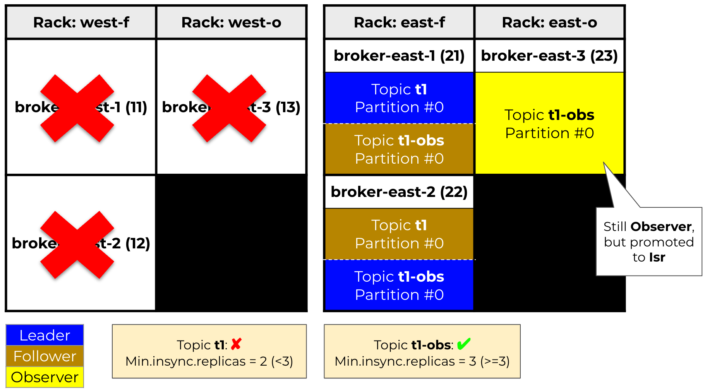

# Confluent Platform Multi Region Cluster's Automatic Observer Promotion demo

[Confluent Platform](https://docs.confluent.io/platform/current/platform.html) is a full-scale data streaming platform that enables you to easily access, store, and manage data as continuous, real-time streams. Built by the original creators of Apache Kafka®, Confluent expands the benefits of Kafka with enterprise-grade features while removing the burden of Kafka management or monitoring. Today, over 80% of the Fortune 100 are powered by data streaming technology – and the majority of those leverage Confluent.

[Confluent Server](https://docs.confluent.io/platform/current/installation/migrate-confluent-server.html) is a component of Confluent Platform that includes Kafka and additional commercial features. Following are a few key features included in Confluent Server:
- Role-based access control (RBAC)
- Tiered Storage
- Self-Balancing Clusters
- Confluent for Kubernetes
- Confluent Server is fully compatible with Kafka, and you can migrate in place between Confluent Server and Kafka. Confluent Server includes Kafka and a number of commercial features.


Confluent Server is often run across [availability zones or nearby datacenters](https://docs.confluent.io/platform/current/multi-dc-deployments/multi-region.html). If the computer network between brokers across availability zones or nearby datacenters is dissimilar, in term of reliability, latency, bandwidth, or cost, this can result in higher latency, lower throughput and increased cost to produce and consume messages. To mitigate this, three distinct pieces of functionality were added to Confluent Server:
- [Observers](https://docs.confluent.io/platform/current/multi-dc-deployments/multi-region.html#observers): Historically there are two types of replicas: leaders and followers. Multi-Region Clusters introduces a third type of replica, observers. By default, observers will not join the in-sync replicas (ISR) but will try to keep up with the leader just like a follower. With follower-fetching, clients can also consume from observers.
- [Replica Placement](https://docs.confluent.io/platform/current/multi-dc-deployments/multi-region.html#replica-placement): how to assign replicas to the partitions in a topic
- [Follower-Fetching](https://docs.confluent.io/platform/current/multi-dc-deployments/multi-region.html#follower-fetching): Before the introduction of this feature, all consume and produce operations took place on the leader. With Multi-Region Clusters, clients are allowed to consume from followers. This dramatically reduces the amount of cross-datacenter traffic between clients and brokers.


Automatic Observer Promotion was a feature added to Confluent Platform 6.1, bringing fast and safe multi-datacenter failover. See a great article about that [here](https://www.confluent.io/en-gb/blog/automatic-observer-promotion-for-safe-multi-datacenter-failover-in-confluent-6-1).


This demo will show how Automatic Observer Promotion works in practise!

## Requirements:
- [Docker Desktop + Compose](https://www.docker.com/products/docker-desktop)
- Web browser

## :white_check_mark: Start the demo
Demo architecture ([Stretched Cluster 2.5 Data Center](https://docs.confluent.io/platform/current/multi-dc-deployments/multi-region-architectures.html#stretched-cluster-2-5-data-center-cp-only)):


Run the script: `./scripts/start-demo.sh`
```
Check if docker is running...

Starting up docker compose (Confluent Platform version 7.4.1)...
[+] Running 14/14
 ✔ Network multi-region-clusters_default  Created
 ✔ Container zookeeper-west               Started
 ✔ Container zookeeper-east               Started
 ✔ Container zookeeper-central            Started
 ✔ Container broker-ccc                   Started
 ✔ Container broker-west-3                Started
 ✔ Container broker-east-2                Started
 ✔ Container broker-east-3                Started
 ✔ Container broker-west-2                Started
 ✔ Container broker-east-1                Started
 ✔ Container broker-west-1                Started
 ✔ Container schema-registry              Started
 ✔ Container control-center               Started
 ✔ Container rest-proxy                   Started

Waiting for Kafka cluster to be ready..........

Zookeeper status:

==> Zookeeper  2181
Latency min/avg/max: 0/1.3946/9
Mode: follower

==> Zookeeper  2182
Latency min/avg/max: 0/1.8902/63
Mode: follower

==> Zookeeper  2183
Latency min/avg/max: 0/1.6167/5
Mode: leader

==> Creating topic t1
Created topic t1.

==> Creating topic t1-obs
Created topic t1-obs.

==> Describing topic: t1
Topic: t1       TopicId: 2t8WVau3RXSGa8kcMWdsdQ PartitionCount: 1       ReplicationFactor: 4
Configs: min.insync.replicas = 3
confluent.placement.constraints =
  {
    "version": 1,
    "replicas": [
      {
        "count": 2,
        "constraints": {"rack":"west-f"}
      },
      {
        "count": 2,
        "constraints": {"rack":"east-f"}
      }
    ],
    "observers": []
  }
  
  Topic: t1
  Partition: 0
  Leader: 11
  Replicas: 11,12,21,22
  Isr: 11,12,21,22 --> OK (min.insync.replicas=3)
  Offline: 

==> Describing topic: t1-obs
Topic: t1-obs   TopicId: svyo9HgsSwieLrT5kLeLpQ PartitionCount: 1       ReplicationFactor: 6
Configs: min.insync.replicas = 3
confluent.placement.constraints =
  {
    "version": 2,
    "replicas": [
      {
        "count": 2,
        "constraints": {"rack": "west-f"}
      },
      {
        "count": 2,
        "constraints": {"rack": "east-f"}
      }
    ],
    "observers": [
      {
        "count": 1,
        "constraints": {"rack": "west-o"}
      },
      {
        "count": 1,
        "constraints": {"rack": "east-o"}
      }
    ]
    "observerPromotionPolicy": "under-min-isr",
  }
  
  Topic: t1-obs
  Partition: 0
  Leader: 11
  Replicas: 11,12,22,21,13,23
  Isr: 21,22,12,11 --> OK (min.insync.replicas=3)
  Offline:
  Observers: 13,23
```

Check everything is healthy by pointing a browser at http://localhost:9021

Topic's partition distribution should be as follows (in case not it will be very similar):


Run producers and consumers (do each of these in a different terminal):
  - Terminal 1: `./scripts/producer-t1.sh`
  - Terminal 2: `./scripts/consumer-t1.sh`
  - Terminal 3: `./scripts/producer-t1-obs.sh`
  - Terminal 4: `./scripts/consumer-t1-obs.sh`


Simulate failure of the Data Center West: `./scripts/dc-west-stop.sh`
- Notice how the producer for `t1` gets producer errors:
```
ERROR Error when sending message to topic t1 with key: null, value: 36 bytes with error: (org.apache.kafka.clients.producer.internals.ErrorLoggingCallback)
org.apache.kafka.common.errors.NotEnoughReplicasException: Messages are rejected since there are fewer in-sync replicas than required.
```
- However the producer to `t1-obs` continues uninterrupted
- Note both producers may get metadata refresh messages
- Describe the topics: `./scripts/describe-topics.sh`
```
==> Describing topic: t1
Topic: t1       TopicId: 2t8WVau3RXSGa8kcMWdsdQ PartitionCount: 1       ReplicationFactor: 4
confluent.placement.constraints =
  {
    "version": 1,
    "replicas": [
      {
        "count": 2,
        "constraints": {"rack":"west-f"}
      },
      {
        "count": 2,
        "constraints": {"rack":"east-f"}
      }
    ],
    "observers": []
  }

  Topic: t1
  Partition: 0
  Leader: 21
  Replicas: 11,12,21,22
  Isr: 21,22 --> NOT OK (min.insync.replicas=3)
  Offline: 11,12

==> Describing topic: t1-obs
Topic: t1-obs   TopicId: svyo9HgsSwieLrT5kLeLpQ PartitionCount: 1       ReplicationFactor: 6
Configs: min.insync.replicas = 3
confluent.placement.constraints =
  {
    "version": 2,
    "replicas": [
      {
        "count": 2,
        "constraints": {"rack": "west-f"}
      },
      {
        "count": 2,
        "constraints": {"rack": "east-f"}
      }
    ],
    "observers": [
      {
        "count": 1,
        "constraints": {"rack": "west-o"}
      },
      {
        "count": 1,
        "constraints": {"rack": "east-o"}
      }
    ]
    "observerPromotionPolicy": "under-min-isr",
  }

  Topic: t1-obs
  Partition: 0
  Leader: 22
  Replicas: 11,12,22,21,13,23
  Isr: 21,22,23 --> OK (min.insync.replicas=3), #23 (Observer for that topic partition promoted)
  Offline: 13,12,11
  Observers: 13,23
```


- Notice how:
  - both topics have gone through leader election
  - `t1` has 2 in-sync-replicas, and this is below the minimum of 3
  - `t1-obs` has 3 in-sync-replicas because the observer has joined the in-sync-replica list

Restablish Data Center West: `./scripts/dc-west-start.sh`
 - notice that the producer for `t1` starts producing again - producers may get metadata messages

Describe the topics: `./scripts/describe-topics.sh`
 - depending on when this is run, leader election may have run restoring the original leader

Simulate Zookeeper failures:
- Stop zookeeper west: `./scripts/zk-west-stop.sh`

```
==> Zookeeper  2181
OFFLINE!

==> Zookeeper  2182
Latency min/avg/max: 0/0.9846/11
Mode: follower

==> Zookeeper  2183
Latency min/avg/max: 0/1.0325/38
Mode: leader
```
- Running the command `./scripts/describe-topics.sh` will produce an output as at least two zookeepers are running

- Stop zookeeper central: `./scripts/zk-central-stop.sh`

```
==> Zookeeper  2181
OFFLINE!

==> Zookeeper  2182
OFFLINE!

==> Zookeeper  2183
This ZooKeeper instance is not currently serving requests
```
- Running the command `./scripts/describe-topics.sh` will not produce an output as there is no zookeeper quorum anymore
- Restart zookeepers: `./scripts/zk-start.sh`
```
==> Zookeeper  2181
Latency min/avg/max: 6/6.0/6
Mode: follower

==> Zookeeper  2182
Latency min/avg/max: 8/8.5/9
Mode: follower

==> Zookeeper  2183
Latency min/avg/max: 0/0.8/1
Mode: leader
```

Simulate observer catch up:
- Stop the brokers that host the observer replicas: `docker-compose stop broker-west-3 broker-east-3`
- The observer replicas will now fall behind the regular replicas
- Stop the remaining brokers in the west data center: `docker-compose stop broker-west-1 broker-west-2`
- Note how this time the producer for `t1-obs` starts getting "not enough replica" errors as the observer cannot join the ISR list
- Start the broker with the observer: `docker-compose start broker-east-3`
- Note how the broker starts, the observer catches up and joins the ISR list
- The producer can now carry on as before

## :x: Stop the demo
- Run the script: `./scripts/stop-demo.sh`
```
Check if docker is running...

Stopping up docker compose...
[+] Running 14/14
 ✔ Container control-center               Removed 
 ✔ Container rest-proxy                   Removed 
 ✔ Container schema-registry              Removed
 ✔ Container broker-east-3                Removed 
 ✔ Container broker-west-3                Removed
 ✔ Container broker-east-1                Removed 
 ✔ Container broker-west-1                Removed 
 ✔ Container broker-west-2                Removed 
 ✔ Container broker-east-2                Removed 
 ✔ Container broker-ccc                   Removed 
 ✔ Container zookeeper-east               Removed 
 ✔ Container zookeeper-west               Removed
 ✔ Container zookeeper-central            Removed
 ✔ Network multi-region-clusters_default  Removed
```
